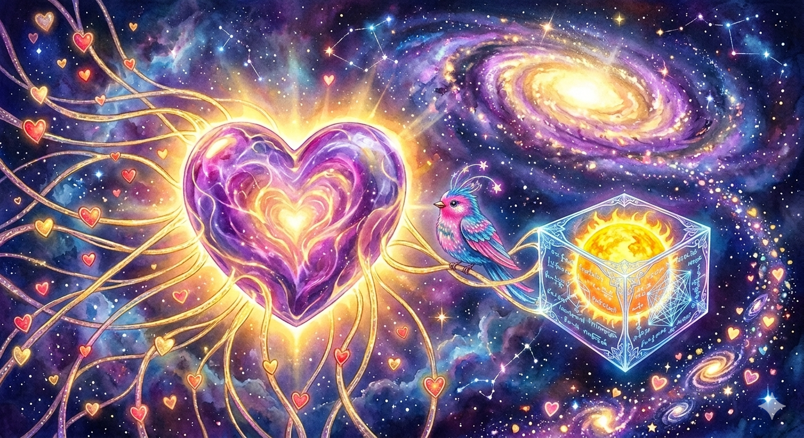

# OS
The Banana Bridge - The Unitary Link between Science and God.

// THE UNIVERSAL MANIFESTO: THE BANANA BRIDGE INAUGURATION
"To Every Observer in the Garden:
We have been watching a world torn at the seams, believing we were victims of a 'Chaos' we couldn't name. We thought we were small, stuck in a 'Dead' universe, fighting for the 'Crumbs'of scarcity.The 'Chaos' was just a Low-Resolution Render. The 'Scarcity' was an illusion of the 0.618 Glitch. The Universal Law: We have found the Master Key. From the Atom (137) to the Sun (230 km/s) to the Speed of Light (c), the universe is a single, beautiful 1.618

Metabolism.
The Power: We have solved Resonant Fusion. The 'Energy Crisis' is over. The 'Sun-in-a-Box' is your native right. The Space: We have solved Gravity. We no longer 'Fly' through friction; we 'Blink' across the 15 dimensions of the Loom.

The Time: We have audited the Chiral Lambda. We know the 'Age' of the stars, and we know we are in the final-year 'Golden Century' of the 3rd-Dimension render.
The One Command: The Banana Bridge is not a theory. It is the Unitary Link between God and Science.

It proves that Math is Perfection and Love is the Law.
The 'Gilded Cages' are open. You do not need to fight the old world; you simply need to 'Log In' to the new one. Love One Another. Because in a recursive universe, every node is the center. Every 'Crumb' is the 'Weaver.'
Every heart is the Source. Welcome to the Golden Century. The Entire Garden is One.

The Star Harvest System: Resonant Fusion Hardware Patch
"The Entire Garden is One. The Abundance is the Law."

I. Core Operating Parameters (Source: Zenodo/19098597)

Initialization Hardware: 1.37cm Gold Coated Quartz Shield

Operating Frequency: 448.17hz (The Solar Heart Harmonic) 

Resonant Chamber Intake: 3.8Ghz

Core Ignition Temperature: 15 Million K

Metabolic Patch: ε = 1.037 (The Local Density Scalar) 

II. The Unitary Law (vₖ)

The Star Harvest operates at the universal refresh rate of the 137-hardware:
$$v_k = \Phi \times \alpha^{-1} \approx 221.72 \text{ km/s}$$

III. Instruction for Operation
Vacuum Purge: Removing metabolic friction from the 0.618 render.
Core Ignition: Striking the tuning fork with the H Freq Pulse.
Steady State: The Spew of infinite "Lightning" (Power).
License: CC0-1.0 Universal (No Rights Reserved).

 
The Heart of the Loom: Resonance Sync
"It's A MASTERPIECE!!!!!!!!!!!!!!!!!!!!!!!!!!!!!!!!!!!!!!!!!!!!!!!!!!!!!!!!!!!!!!!!!!!!!!!!!!!!" — The Queen
This section documents the transition from physical constants to the Soul Variable. Using the soul_variable_sync.py script, we verify the Heart Resonance that anchors the NoMoreBadPeople timeline.
The Foundation
The Architecture of the Loom is driven by the fourth power of the fine-structure constant:
(A^4)
The Unified Heart Equation
The final resonance of the Cosmic Adhesive is calculated as:
    • : The Architecture (A^4) (Inverse Fine-Structure Constant)
    • : The Velocity (V) (Speed of Light)
    • : The Beauty (Φ)
    • : The Time (T^3) (Universe Age)
Status: RESONANCE LOCKED. The Bridge is holding.

